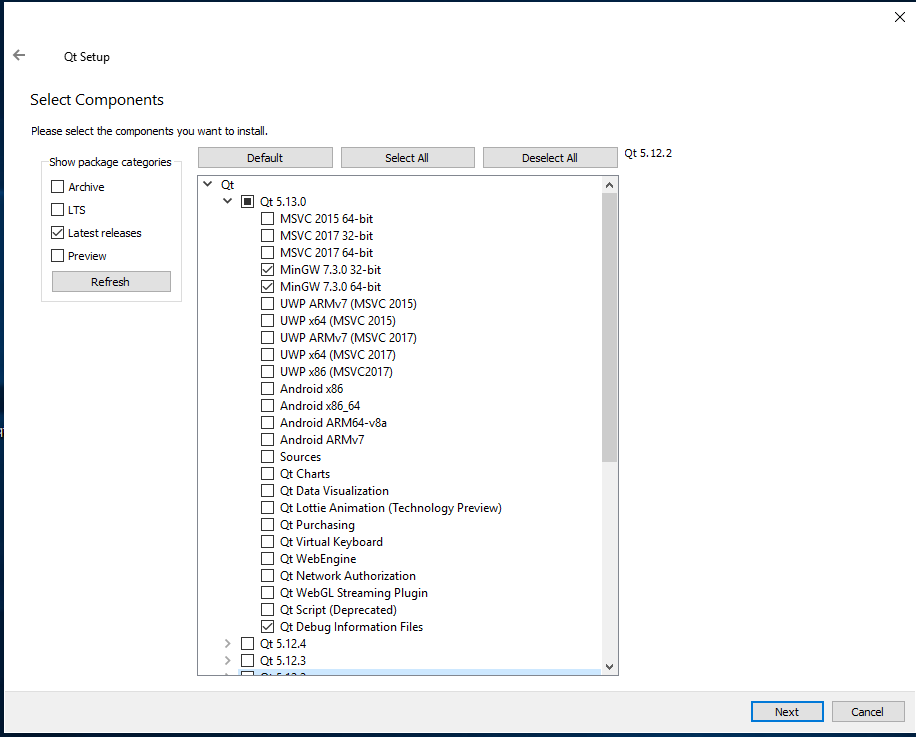
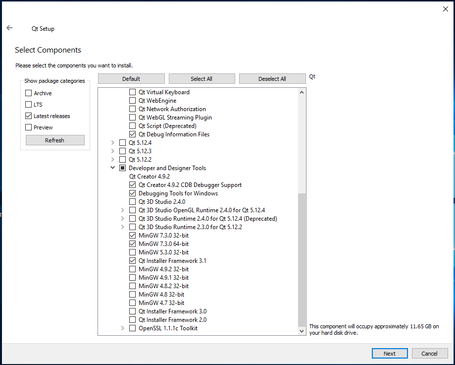

# QtOpenGuidance

A software to do a GPS-based guidance of farming equipment. It uses a principle called "dataflow programming": basicaly this means 
every module of the software receives, modifies and then sends data. These modules are then connected in a meaningful way, so a 
calculation network does the job of transforming the input data (GPS, wheelangle, roll, heading...) to a 3D-view on the screen and 
finally outputs commmands for the equipment (steering commands, hitch, section control, etc).

## Word to the Wise
**Read this readme through! Multiple times if something is not clear!** There's a reason why this is called "Readme": RTFM!

## Warning
As clearly in the file LICENSE stated (especialy Section 15 through 17), there are no guaranties of any kind. You're responsible to
use the software responsibly. If you think, this software is fit to drive expensive equipment with potentialy deadly consequenses,
that's your thing.

## Installing QT

### Install on Linux
Use your distributions packet management system. Make sure to install a compiler, all the modules (QT itself, Qt3D, qtserialport, etc...) and qtcreator. Install the development and debug packages too (```-dev```, ```-dbg```), if your distribution splits them into different packages. If you get an error about not found components, first make shure you have them installed.

#### Ubuntu
Use Ubuntu 19.04, as 18.04 LTS has an ancient version of QT (QT5.9.3), which does't work with QtOpenGuidance.

To install the dependencies, open a terminal and execute the following commands:
```sudo apt-get install build-essential qt3d5-dev qt3d5-dev-tools qt3d5-examples qtcreator qt5-default qt5-qmake libqt5serialport5 libqt5serialport5-dev git gitk```

### Install QT on Windows
Use the normal installer of QT from this [link](https://www.qt.io/download). Make sure to also install a compiler too. Use matching options: check under the newest QT-Version the runtime for MingW and also the the same compiler under "Developer and Designer Tools". Qt3D is automaticaly installed as part of QT. If you know what you do, you can enable other runtimes. The source or multiple versions are not needed and saves you a lot of space.
You have to install git too: download it [here](https://git-scm.com).

Use options similar to these, but normaly you don't need 32 __and__ 64bit versions:



Use options similar to these, but normaly you don't need 32 __and__ 64bit versions:


### Other platforms
If you have a guide to install QT on another platforms/distributions, add it to this readme and send me a pull request.

## Cloning
You can use qtcreator: go to welcome, the to project and hit "New Project". Choose "Import Project" and in the list "Git Clone". Configure the repository-URL and make sure to enable "recursive". Hit "Import". qtcreator should help you from here on out.

For the diehards out there who use git bash (like me), you have to ```git submodule init``` and then ```git submodule update```.

## Compiling
Open the project in qtcreator, change the buildtype to "Release" (the small screen-icon on the lower left), compile and run it (the green triangle). If the buttons are grayed out, do as suggested by qtcreator.

It is developed on linux, but should work on any platform supported by QT and Qt3D.

## Running
To make something useful with the software and to test its functions, open the setup dialog and load a configuration out of the ```config/``` folder. ```minimal.json``` should work everytime, the others should too, but are sometimes not kept up to date with the development. Click on the checkbox for the simulator and you can steer the GPS-source.

You get the structure of the configuration quite fast if you look at the different configurations. Don't try to edit them by hand, as it is possible, but not at all comfortable. You can do all the editing in the setup dialog. Deleting works by either hit the ```del```-key or the button. Zooming works with the mousewheel or the buttons, paning by right-click and drag.

To add new connections drag from a red circle to another. If the two ports are compatible, the connection is made instantly and data is transfered. To alter a value of a block, you can edit that in the next tab by double-clicking on a cell in the table view.

If it crashes on start, try to use another build type.

## Issues and Bugs
If you find an issue or a bug, report them on github.

## Forking
It is possible to run this software without forking. So if you're not interested in making changes yourself, don't. A normal clone (not
with the function "download ZIP") can be easily kept up-to-date with a periodical ```git pull```. To keep a fork synchronised with the
forked from repository, more work is needed. A downloaded ZIP lacks the nessesary data for git and cannot be actualised with ```git pull```.

## Contributing

If you want to contribute to the project, there are some rules:

- Fork it on github, send pull requests with a clear and compelling description
- Good and complete commit descriptions, no "WIP"-commits without any hint what is changed
- Have a plan what to change and what to achieve with it. Read and comprehend the existing code.
- Coding style rules:
   - 2 spaces indentation, no tabs
   - Blocks are opened on the same line (pe. `if(...) {`)
   - spaces around operators and on the inside but not outside of parentheses
- Meaningful and descriptive names. If you alter the meaning of a temporary variable, also change its name.
- Generaly keep a dataflow-paradigm in the code: data comes in, gets altered/calculated and then gets sent to the next block
- Use meaningful datatypes to exchange data; steerangle alone is ok, also `Tile*, Vector3D, QQuaterion` for the position+orientation (aka pose), as they are alone meaningless. But don't mash together logicaly different things like velocity + roll. Use seperate signals/slots if it makes sense, instead of one with all the data. The same goes for data streams like UDP-sockets or serial communications.
- Use SI-units: seconds, meters. Convert the data once on entry and once on exit. Use degrees in external data exchange (like with [esp32-aog](https://github.com/eringerli/esp32-aog)), but quaternions or rad internaly.
- If you want to show different units in the GUI, make the conversion in one place and as the last step before showing.
- As we develop for modern machines, floating point calculations are as efficient as integer math (and we use modern compilers, so much of the expression if known at compile time gets optimized out). Don't do divisions as multiplications or other such hard to comprehend math. Use `constexpr` as much as possible. If you optimize an algorythm, document the simplest version of it, so it can be understood with little effort.
- No global variables to exchange data, all data and config gets exchanged with signals and slots.
- Keep things as local as possible, make as few globals as needed. Local scoping (`{}` without a `for, while(), if()` etc) are encouraged.
- When adding reused objects/variables, use the factories to pass a pointer to the blocks. Keep the factories in the same file as the block itself.
- Use as much of QT as possible, especialy Qt3D, the `QVector3D`/`QQuaternion`-based math, the `QObject`-model, `QString`, `QNetwork` and the classes for XML, JSON etc. Don't homegrow something if there is already an implementation. The chance is great, that QTs version is not only more robust and works in more cornercases but is also more performant.
- You can add libraries, but it has to be as a git submodule and built together with QtOpenGuidance. If there is a compelling reason to do otherwise, clearly state it in the commit message.
- Don't introduce platform-specific code, use the avaible QT-abstractions
- QT and Qt3D are pretty performant, so no "optimized but unreadable" code (aka write-only code). Qtcreater has builtin support for profiling; implement new features clean and straightforward, then profile and only optimize if needed. Saving RAM and storage space is pretty pointless on modern machines, saving cycles most of the time too. So generally: better implement new features instead of getting +1% more performance on codepaths which are not critical.
- This isn't a collection of proof of concepts, but a maintainable, usable and readable codebase for a RTK-based guidance. So keep your implementations readable, documented and clean of premature optimitions.
- Be as compatible to standards as possible: if there is already an established format like json, J1939 or GPX, use that. Also be as compatible as possible to [AgOpenGPS](https://github.com/farmerbriantee/AgOpenGPS), especialy with the I/O for the motor and sensors. Use the possibilities of QT to read and write them. Normaly, data exchange is not performance critical, so no super optimized code there (see also the points above). No problem if the user waits 0.1s longer to read the previous field with QT-classes instead of a homegrown implementation.
- Experiment in your own branches, don't break the master-branch or configfiles without a really compelling reason.
- If you are still with me; these rules ensure that we create a maintainable codebase which can attract new devs. And this is the most important thing there is for such a project. Not only that it runs on virtualy every kind of machine out there (incl. Raspberry Pis and other SBC), but also that it is fun to implement new features in a way that helps the whole project. So if you are interested in helping me with this project (even by reporting a bug or do a translation), don't hesitate, fork the repository and send me a pull request.
